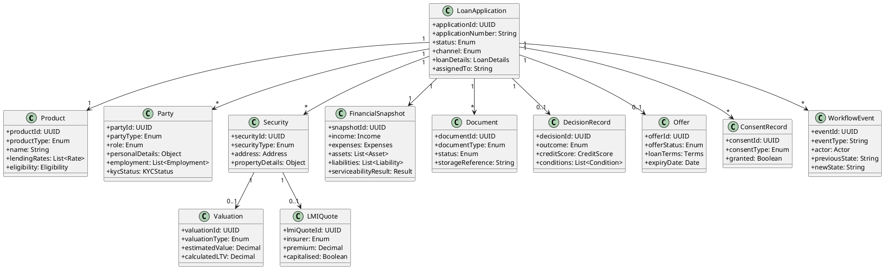
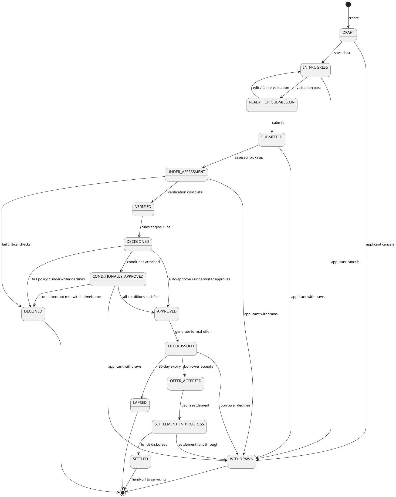
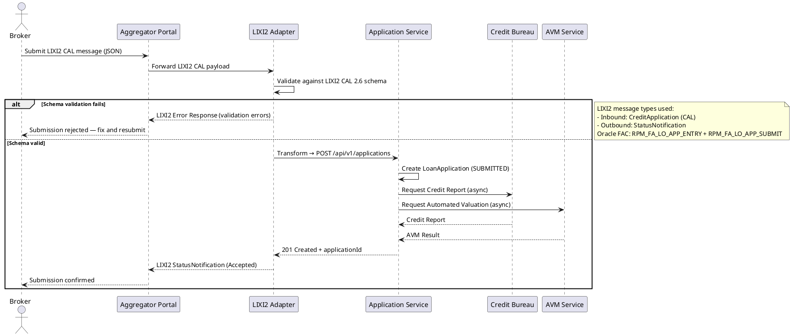
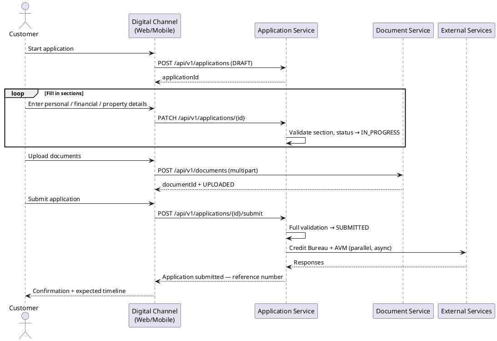
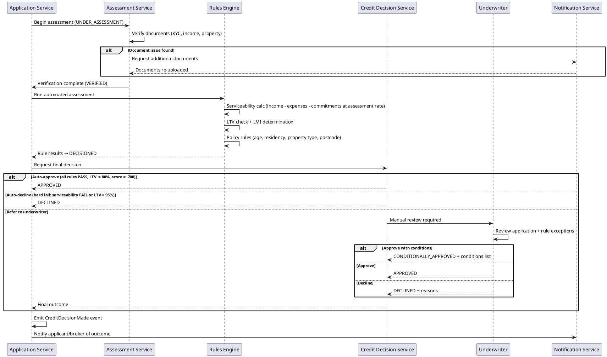
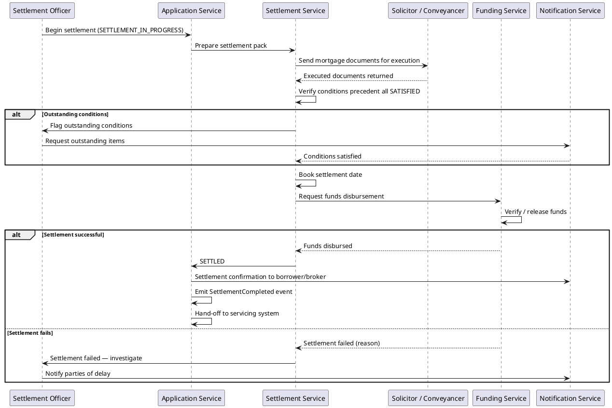
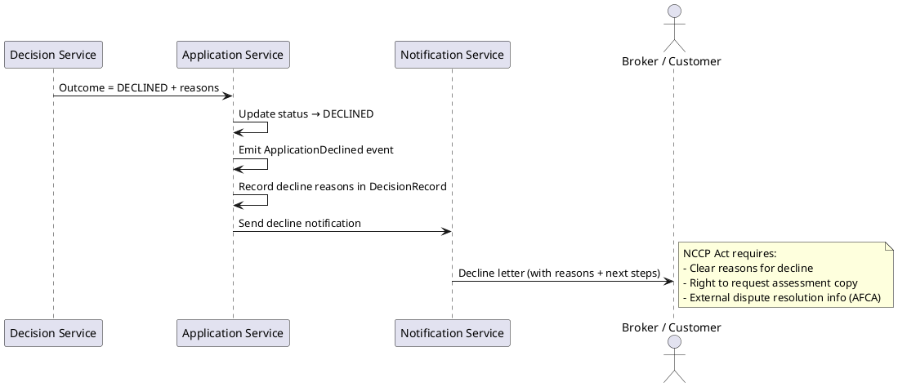
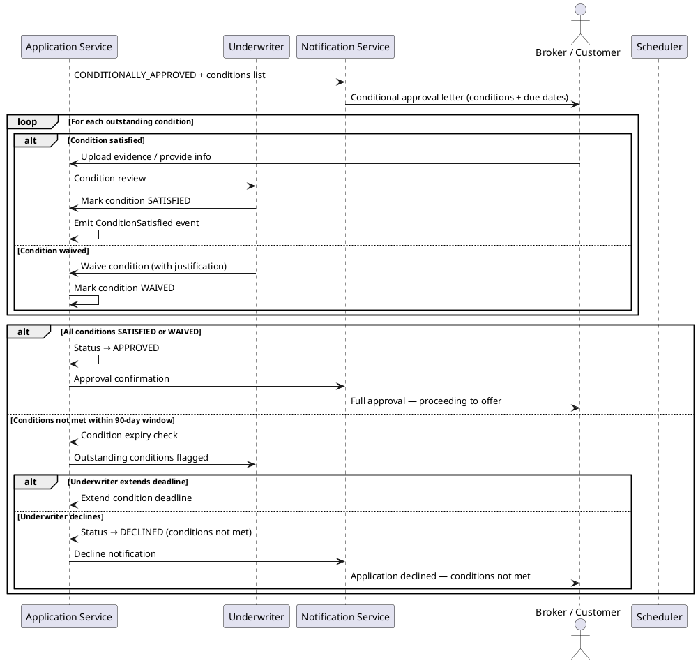
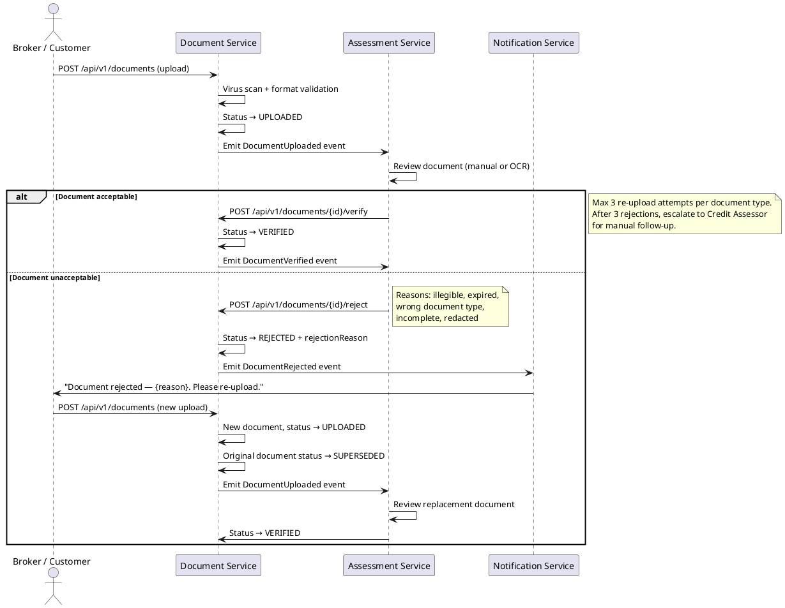
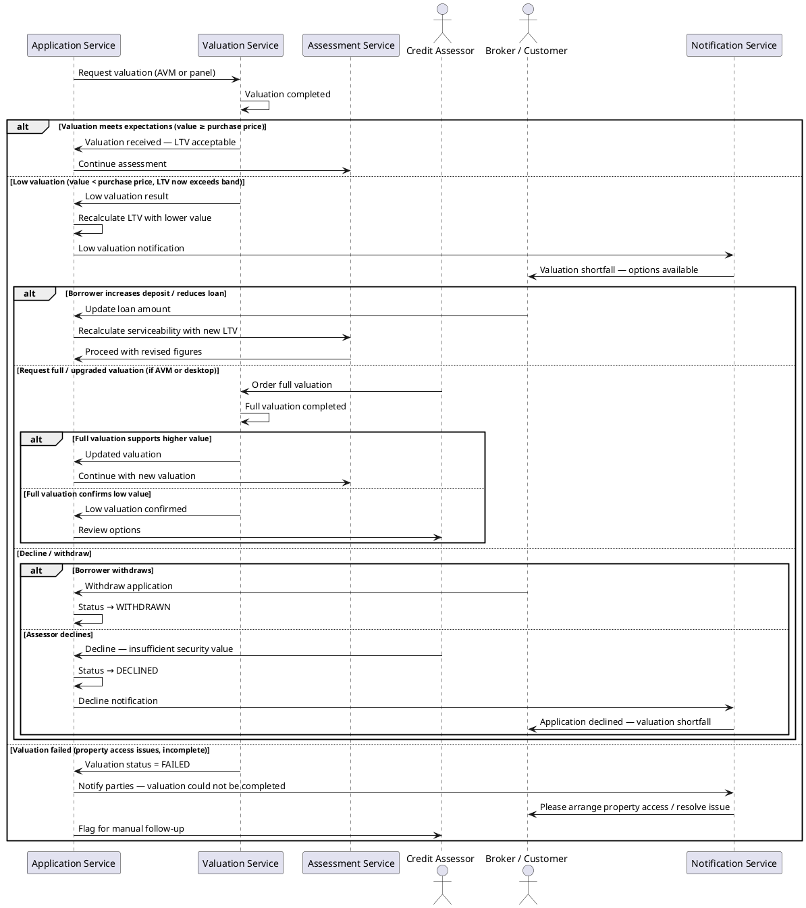

# Mortgage Origination System — Software Requirements Specification (SRS)

**Project**: Atheryon Mortgages
**Repository**: https://github.com/atheryon-ai/atheryon-mortgages
**Version**: 2.0
**Date**: 14 April 2026
**Status**: Ready for Technical Design
**Audience**: Claude — for producing detailed HLD, ERD, Swagger/OpenAPI, DB schema, microservices, state machines, and LIXI2 adapters.

## 1. Introduction & Purpose

This SRS defines all required data objects, lifecycles, domain events, and business processes for a mortgage origination system for Australian residential lending.

The data model (state) and state machine (business process logic) draw inspiration from:
- **LIXI2 Credit Application Standard** (CAL 2.6.x) — the canonical Australian mortgage data interchange format, providing rich entity schemas for parties, securities, financial positions, and documents.
- **Oracle Banking Platform (OBP) — Origination of Loans & Mortgages** — particularly its Functional Activity Codes (FACs), workflow orchestration patterns, and lifecycle state management.
- **Australian CDR Open Banking** — Product Reference Data API for rate/fee/feature catalogue.

Atheryon's model takes the best of both: LIXI2's deep domain vocabulary for data representation, and OBP's rigorous state machine and orchestration patterns for moving applications through the origination lifecycle.

## 2. Scope

**In Scope**: Full residential mortgage origination (purchase, refinance, construction, equity release) for broker and direct channels, from pre-approval through to settlement hand-off.

**Out of Scope**: Post-settlement loan servicing, commercial/business lending, personal loans, credit cards.

**Target Database**: PostgreSQL 15+
**Target Architecture**: Java/Spring Boot microservices with event-driven backbone

---

## 3. Business Processes

| # | Process | Key Actors | Oracle FAC Inspiration |
|---|---------|-----------|----------------------|
| 1 | Product Enquiry / Pre-Application | Customer, Broker | RPM_FA_LO_ENQUIRY |
| 2 | Application Initiation / Capture | Customer, Broker, System | RPM_FA_LO_APP_ENTRY |
| 3 | Application Submission | Broker, Customer, LIXI2 Adapter | RPM_FA_LO_APP_SUBMIT |
| 4 | Assessment & Verification | Credit Assessor, System | RPM_FA_LO_APP_ASSESS |
| 5 | Decisioning & Approval | Rules Engine, Underwriter | RPM_FA_LO_APP_DECISION |
| 6 | Offer & Acceptance | System, Customer | RPM_FA_LO_OFFER |
| 7 | Settlement & Funding | Settlement Officer, Solicitor | RPM_FA_LO_SETTLE |
| 8 | Hand-Off to Servicing | System | RPM_FA_LO_HANDOFF |

---

## 4. Detailed Data Model

### 4.1 Product (CDR + Oracle Business Product)
```json
{
  "productId": "string (UUID)",
  "productCategory": "RESIDENTIAL_MORTGAGE",
  "productType": "STANDARD_VARIABLE | BASIC_VARIABLE | FIXED_RATE | SPLIT_LOAN | CONSTRUCTION | LINE_OF_CREDIT",
  "name": "string",
  "brand": "string",
  "effectiveFrom": "date",
  "effectiveTo": "date | null",
  "lendingRates": [{
    "lendingRateType": "VARIABLE | FIXED | INTRODUCTORY",
    "rate": "decimal (e.g. 0.0629)",
    "comparisonRate": "decimal",
    "calculationFrequency": "P1D",
    "applicationFrequency": "P1M",
    "fixedTermMonths": "int | null",
    "tiers": [{
      "name": "string",
      "minimumValue": "decimal",
      "maximumValue": "decimal",
      "rateApplicationMethod": "WHOLE_BALANCE | PER_TIER"
    }]
  }],
  "features": ["OFFSET_ACCOUNT", "REDRAW", "PORTABLE", "CASHBACK", "MULTI_OFFSET", "EXTRA_REPAYMENTS", "INTEREST_ONLY"],
  "eligibility": {
    "minimumAge": 18,
    "maximumLTV": "decimal (e.g. 0.95)",
    "minimumLoanAmount": "decimal",
    "maximumLoanAmount": "decimal",
    "allowedPurposes": ["PURCHASE", "REFINANCE", "CONSTRUCTION", "EQUITY_RELEASE"],
    "allowedOccupancyTypes": ["OWNER_OCCUPIED", "INVESTMENT"],
    "allowedRepaymentTypes": ["PRINCIPAL_AND_INTEREST", "INTEREST_ONLY"]
  },
  "fees": [{
    "feeType": "APPLICATION | VALUATION | SETTLEMENT | MONTHLY_SERVICE | ANNUAL | DISCHARGE | BREAK_COST",
    "name": "string",
    "amount": "decimal",
    "balanceRate": "decimal | null",
    "currency": "AUD"
  }],
  "constraints": {
    "minimumTermMonths": 12,
    "maximumTermMonths": 360,
    "minimumInterestOnlyMonths": 0,
    "maximumInterestOnlyMonths": 60
  }
}
```

### 4.2 Party (LIXI2 Person/Company + Oracle Party)
```json
{
  "partyId": "string (UUID)",
  "partyType": "INDIVIDUAL | COMPANY | TRUST | SMSF",
  "role": "PRIMARY_BORROWER | CO_BORROWER | GUARANTOR | SOLICITOR | BROKER | THIRD_PARTY",
  "personalDetails": {
    "title": "string",
    "firstName": "string",
    "middleNames": "string | null",
    "surname": "string",
    "dateOfBirth": "date",
    "gender": "MALE | FEMALE | OTHER | UNSPECIFIED",
    "residencyStatus": "AUSTRALIAN_CITIZEN | PERMANENT_RESIDENT | TEMPORARY_VISA | NON_RESIDENT",
    "visaSubclass": "string | null",
    "maritalStatus": "SINGLE | MARRIED | DEFACTO | DIVORCED | WIDOWED",
    "numberOfDependants": "int",
    "dependantAges": ["int"]
  },
  "companyDetails": {
    "companyName": "string | null",
    "abn": "string | null",
    "acn": "string | null",
    "companyType": "PTY_LTD | PUBLIC | SOLE_TRADER | PARTNERSHIP",
    "registrationDate": "date | null",
    "trustDetails": {
      "trustName": "string | null",
      "trustType": "FAMILY | UNIT | DISCRETIONARY | HYBRID",
      "trusteeType": "INDIVIDUAL | CORPORATE"
    }
  },
  "identification": [{
    "idType": "DRIVERS_LICENCE | PASSPORT | MEDICARE | BIRTH_CERTIFICATE",
    "idNumber": "string",
    "issuingState": "string | null",
    "expiryDate": "date | null",
    "verified": "boolean"
  }],
  "taxFileNumber": "string (encrypted, 9 digits)",
  "contact": {
    "email": "string",
    "mobilePhone": "string",
    "homePhone": "string | null",
    "workPhone": "string | null",
    "preferredContactMethod": "EMAIL | SMS | PHONE"
  },
  "addresses": [{
    "addressType": "CURRENT_RESIDENTIAL | PREVIOUS_RESIDENTIAL | POSTAL | EMPLOYER",
    "unitNumber": "string | null",
    "streetNumber": "string",
    "streetName": "string",
    "streetType": "string",
    "suburb": "string",
    "state": "NSW | VIC | QLD | WA | SA | TAS | ACT | NT",
    "postcode": "string (4 digits)",
    "country": "AU",
    "yearsAtAddress": "int",
    "monthsAtAddress": "int",
    "housingStatus": "RENTING | OWN_HOME_WITH_MORTGAGE | OWN_HOME_NO_MORTGAGE | BOARDING | LIVING_WITH_PARENTS"
  }],
  "employment": [{
    "employmentType": "PAYG_FULL_TIME | PAYG_PART_TIME | PAYG_CASUAL | SELF_EMPLOYED | CONTRACT | RETIRED | HOME_DUTIES | STUDENT | UNEMPLOYED",
    "employerName": "string",
    "occupation": "string",
    "industry": "string",
    "startDate": "date",
    "endDate": "date | null",
    "annualBaseSalary": "decimal",
    "annualOvertime": "decimal | null",
    "annualBonus": "decimal | null",
    "annualCommission": "decimal | null",
    "annualAllowances": "decimal | null",
    "abnForSelfEmployed": "string | null",
    "isCurrent": "boolean"
  }],
  "kycStatus": {
    "status": "NOT_STARTED | IN_PROGRESS | VERIFIED | FAILED",
    "amlCheckDate": "datetime | null",
    "sanctionsCheckDate": "datetime | null",
    "pepStatus": "boolean",
    "verificationMethod": "ELECTRONIC | MANUAL | VOI_PROVIDER"
  }
}
```

### 4.3 LoanApplication (Root Aggregate — Oracle LoanApplication + LIXI2 CAL)
```json
{
  "applicationId": "string (UUID)",
  "applicationNumber": "string (human-readable, e.g. ATH-2026-000123)",
  "status": "DRAFT | IN_PROGRESS | READY_FOR_SUBMISSION | SUBMITTED | UNDER_ASSESSMENT | VERIFIED | DECISIONED | CONDITIONALLY_APPROVED | APPROVED | DECLINED | OFFER_ISSUED | OFFER_ACCEPTED | SETTLEMENT_IN_PROGRESS | SETTLED | WITHDRAWN | LAPSED",
  "channel": "BROKER | DIRECT_ONLINE | DIRECT_BRANCH | DIRECT_PHONE",
  "productId": "string (FK → Product)",
  "parties": [{
    "partyId": "string (FK → Party)",
    "role": "PRIMARY_BORROWER | CO_BORROWER | GUARANTOR",
    "ownershipPercentage": "decimal"
  }],
  "loanDetails": {
    "purpose": "PURCHASE | REFINANCE | CONSTRUCTION | EQUITY_RELEASE",
    "occupancyType": "OWNER_OCCUPIED | INVESTMENT",
    "requestedAmount": "decimal",
    "termMonths": "int",
    "interestType": "VARIABLE | FIXED | SPLIT",
    "fixedPortionAmount": "decimal | null",
    "fixedTermMonths": "int | null",
    "repaymentType": "PRINCIPAL_AND_INTEREST | INTEREST_ONLY",
    "interestOnlyPeriodMonths": "int | null",
    "repaymentFrequency": "WEEKLY | FORTNIGHTLY | MONTHLY",
    "firstHomeBuyer": "boolean",
    "existingLoanRefinanceDetails": {
      "currentLender": "string | null",
      "currentBalance": "decimal | null",
      "currentRate": "decimal | null",
      "accountNumber": "string | null"
    },
    "constructionDetails": {
      "estimatedBuildCost": "decimal | null",
      "buildStages": "int | null",
      "builderName": "string | null",
      "contractSigned": "boolean | null"
    }
  },
  "securities": [{"securityId": "string (FK → Security)"}],
  "financialSnapshot": {"snapshotId": "string (FK → FinancialSnapshot)"},
  "documents": [{"documentId": "string (FK → Document)"}],
  "decisionRecord": {"decisionId": "string (FK → DecisionRecord) | null"},
  "offer": {"offerId": "string (FK → Offer) | null"},
  "consents": [{"consentId": "string (FK → ConsentRecord)"}],
  "brokerDetails": {
    "brokerId": "string | null",
    "brokerCompany": "string | null",
    "aggregatorId": "string | null",
    "aggregatorName": "string | null",
    "brokerReference": "string | null"
  },
  "timestamps": {
    "createdAt": "datetime",
    "updatedAt": "datetime",
    "submittedAt": "datetime | null",
    "assessmentStartedAt": "datetime | null",
    "decisionedAt": "datetime | null",
    "offerIssuedAt": "datetime | null",
    "offerAcceptedAt": "datetime | null",
    "settlementDate": "date | null",
    "settledAt": "datetime | null",
    "withdrawnAt": "datetime | null"
  },
  "assignedTo": "string | null (userId of current handler)"
}
```

### 4.4 Security / Collateral (LIXI2 Security)
```json
{
  "securityId": "string (UUID)",
  "securityType": "EXISTING_RESIDENTIAL | NEW_RESIDENTIAL | VACANT_LAND | RURAL_RESIDENTIAL | STRATA_UNIT | HOUSE_AND_LAND_PACKAGE",
  "primaryPurpose": "SECURITY_ONLY | PURCHASE_SECURITY | CONSTRUCTION_SECURITY",
  "address": {
    "unitNumber": "string | null",
    "streetNumber": "string",
    "streetName": "string",
    "streetType": "string",
    "suburb": "string",
    "state": "string",
    "postcode": "string",
    "country": "AU",
    "lotNumber": "string | null",
    "planNumber": "string | null",
    "titleReference": "string | null"
  },
  "propertyDetails": {
    "propertyCategory": "HOUSE | UNIT | TOWNHOUSE | APARTMENT | VACANT_LAND | RURAL",
    "numberOfBedrooms": "int | null",
    "landAreaSqm": "decimal | null",
    "floorAreaSqm": "decimal | null",
    "yearBuilt": "int | null",
    "isNewConstruction": "boolean",
    "zoning": "RESIDENTIAL | RURAL_RESIDENTIAL | MIXED_USE"
  },
  "ownership": [{
    "partyId": "string",
    "ownershipType": "SOLE | JOINT_TENANTS | TENANTS_IN_COMMON",
    "percentage": "decimal"
  }],
  "valuation": {"valuationId": "string (FK → Valuation) | null"},
  "lmiQuote": {"lmiQuoteId": "string (FK → LMIQuote) | null"},
  "encumbrances": [{
    "type": "EXISTING_MORTGAGE | CAVEAT | EASEMENT | COVENANT",
    "holder": "string",
    "toBeDischarged": "boolean"
  }],
  "contractOfSale": {
    "purchasePrice": "decimal | null",
    "contractDate": "date | null",
    "settlementDate": "date | null",
    "depositPaid": "decimal | null",
    "vendor": "string | null"
  }
}
```

### 4.5 FinancialSnapshot (LIXI2 Financial Position)
```json
{
  "snapshotId": "string (UUID)",
  "applicationId": "string (FK)",
  "capturedAt": "datetime",
  "income": {
    "totalGrossAnnualIncome": "decimal (derived)",
    "totalNetAnnualIncome": "decimal (derived)",
    "incomeItems": [{
      "partyId": "string",
      "incomeType": "SALARY | OVERTIME | BONUS | COMMISSION | RENTAL | GOVERNMENT_BENEFIT | SUPERANNUATION | DIVIDEND | SELF_EMPLOYED_INCOME | OTHER",
      "grossAnnualAmount": "decimal",
      "netAnnualAmount": "decimal",
      "frequency": "WEEKLY | FORTNIGHTLY | MONTHLY | ANNUALLY",
      "verified": "boolean",
      "verificationSource": "PAYSLIP | TAX_RETURN | BANK_STATEMENT | CENTRELINK_LETTER | RENTAL_AGREEMENT | ACCOUNTANT_LETTER | null"
    }]
  },
  "expenses": {
    "declaredMonthlyExpenses": "decimal",
    "hemMonthlyBenchmark": "decimal (system-calculated)",
    "assessedMonthlyExpenses": "decimal (MAX of declared vs HEM)",
    "expenseItems": [{
      "category": "GENERAL_LIVING | GROCERIES | UTILITIES | INSURANCE | EDUCATION | CHILDCARE | TRANSPORT | ENTERTAINMENT | CLOTHING | MEDICAL | OTHER",
      "monthlyAmount": "decimal",
      "frequency": "WEEKLY | FORTNIGHTLY | MONTHLY",
      "source": "DECLARED | HEM | BANK_STATEMENT_ANALYSIS"
    }]
  },
  "assets": [{
    "assetType": "REAL_ESTATE | SAVINGS | SHARES | SUPERANNUATION | VEHICLE | OTHER",
    "description": "string",
    "estimatedValue": "decimal",
    "partyId": "string"
  }],
  "liabilities": [{
    "liabilityType": "HOME_LOAN | PERSONAL_LOAN | CAR_LOAN | CREDIT_CARD | HECS_HELP | TAX_DEBT | OTHER",
    "lender": "string",
    "outstandingBalance": "decimal",
    "creditLimit": "decimal | null",
    "monthlyRepayment": "decimal",
    "interestRate": "decimal | null",
    "toBeRefinanced": "boolean",
    "partyId": "string"
  }],
  "serviceabilityResult": {
    "calculatedAt": "datetime",
    "netDisposableIncome": "decimal",
    "debtServiceRatio": "decimal",
    "uncommittedMonthlyIncome": "decimal",
    "assessmentRate": "decimal (actual rate + buffer)",
    "bufferRate": "decimal (APRA mandated, currently 0.03)",
    "outcome": "PASS | FAIL | MARGINAL",
    "notes": "string | null"
  }
}
```

### 4.6 Document
```json
{
  "documentId": "string (UUID)",
  "applicationId": "string (FK)",
  "partyId": "string (FK) | null",
  "documentType": "PAYSLIP | TAX_RETURN | BANK_STATEMENT | DRIVERS_LICENCE | PASSPORT | RATES_NOTICE | CONTRACT_OF_SALE | VALUATION_REPORT | LOAN_STATEMENT | COMPANY_FINANCIALS | TRUST_DEED | ACCOUNTANT_LETTER | BUILDING_CONTRACT | COUNCIL_APPROVAL | INSURANCE_CERTIFICATE | OTHER",
  "documentCategory": "IDENTITY | INCOME | EXPENSE | ASSET | LIABILITY | PROPERTY | LEGAL | OTHER",
  "status": "REQUESTED | UPLOADED | UNDER_REVIEW | VERIFIED | REJECTED | SUPERSEDED",
  "fileName": "string",
  "mimeType": "string",
  "fileSizeBytes": "int",
  "storageReference": "string (S3/blob path)",
  "uploadedBy": "string (userId or partyId)",
  "uploadedAt": "datetime",
  "verifiedBy": "string | null",
  "verifiedAt": "datetime | null",
  "rejectionReason": "string | null",
  "expiryDate": "date | null",
  "metadata": {
    "periodFrom": "date | null",
    "periodTo": "date | null",
    "issuingOrganisation": "string | null"
  }
}
```

### 4.7 DecisionRecord
```json
{
  "decisionId": "string (UUID)",
  "applicationId": "string (FK)",
  "decisionType": "AUTOMATED | MANUAL | HYBRID",
  "outcome": "APPROVED | CONDITIONALLY_APPROVED | DECLINED | REFERRED_TO_UNDERWRITER",
  "decisionDate": "datetime",
  "decidedBy": "string (userId or 'SYSTEM')",
  "delegatedAuthorityLevel": "LEVEL_1_AUTO | LEVEL_2_ASSESSOR | LEVEL_3_SENIOR_UNDERWRITER | LEVEL_4_CREDIT_MANAGER",
  "creditScore": {
    "bureau": "EQUIFAX | ILLION | EXPERIAN",
    "score": "int",
    "reportDate": "date",
    "reportReference": "string"
  },
  "policyRuleResults": [{
    "ruleId": "string",
    "ruleName": "string",
    "result": "PASS | FAIL | WARNING | NOT_APPLICABLE",
    "detail": "string | null"
  }],
  "conditions": [{
    "conditionId": "string (UUID)",
    "conditionType": "PRIOR_TO_SETTLEMENT | PRIOR_TO_DRAWDOWN | ONGOING",
    "description": "string",
    "status": "OUTSTANDING | SATISFIED | WAIVED",
    "satisfiedDate": "date | null",
    "satisfiedBy": "string | null"
  }],
  "declineReasons": ["string"],
  "maxApprovedAmount": "decimal | null",
  "approvedLTV": "decimal | null",
  "expiryDate": "date (typically 90 days from decision)"
}
```

### 4.8 Offer
```json
{
  "offerId": "string (UUID)",
  "applicationId": "string (FK)",
  "offerStatus": "DRAFT | ISSUED | VIEWED | ACCEPTED | DECLINED | EXPIRED | WITHDRAWN",
  "offerDate": "date",
  "expiryDate": "date (typically 30 days from issue)",
  "loanTerms": {
    "approvedAmount": "decimal",
    "interestRate": "decimal",
    "comparisonRate": "decimal",
    "rateType": "VARIABLE | FIXED",
    "fixedTermMonths": "int | null",
    "termMonths": "int",
    "repaymentType": "PRINCIPAL_AND_INTEREST | INTEREST_ONLY",
    "estimatedMonthlyRepayment": "decimal",
    "totalInterestOverTerm": "decimal",
    "fees": [{
      "feeType": "string",
      "amount": "decimal",
      "when": "AT_SETTLEMENT | MONTHLY | ANNUALLY"
    }]
  },
  "conditionsPrecedent": [{
    "conditionId": "string",
    "description": "string",
    "status": "OUTSTANDING | SATISFIED | WAIVED"
  }],
  "lmiRequired": "boolean",
  "lmiPremium": "decimal | null",
  "lmiCapitalised": "boolean | null",
  "acceptance": {
    "acceptedDate": "datetime | null",
    "acceptedBy": "string | null",
    "acceptanceMethod": "DIGITAL | WET_SIGNATURE | SOLICITOR",
    "coolingOffExpiryDate": "date | null"
  }
}
```

### 4.9 Valuation
```json
{
  "valuationId": "string (UUID)",
  "securityId": "string (FK)",
  "valuationType": "AUTOMATED_AVM | DESKTOP | KERBSIDE | SHORT_FORM | FULL_INTERNAL | FULL_EXTERNAL",
  "provider": "string (e.g. CoreLogic, Valex, panel valuer name)",
  "requestedDate": "date",
  "completedDate": "date | null",
  "status": "REQUESTED | IN_PROGRESS | COMPLETED | FAILED | DISPUTED",
  "estimatedValue": "decimal | null",
  "forcedSaleValue": "decimal | null",
  "valuationConfidence": "HIGH | MEDIUM | LOW",
  "calculatedLTV": "decimal | null",
  "reportReference": "string | null",
  "valuerComments": "string | null",
  "expiryDate": "date (typically 90 days from completion)"
}
```

### 4.10 LMIQuote
```json
{
  "lmiQuoteId": "string (UUID)",
  "securityId": "string (FK)",
  "applicationId": "string (FK)",
  "insurer": "GENWORTH | QBE | ARCH",
  "quoteDate": "date",
  "ltvBand": "string (e.g. 80.01-85.00)",
  "loanAmount": "decimal",
  "propertyValue": "decimal",
  "premium": "decimal",
  "stampDutyOnPremium": "decimal",
  "totalCost": "decimal",
  "capitalised": "boolean",
  "quoteReference": "string",
  "quoteExpiryDate": "date",
  "status": "QUOTED | ACCEPTED | EXPIRED | NOT_REQUIRED"
}
```

### 4.11 ConsentRecord
```json
{
  "consentId": "string (UUID)",
  "applicationId": "string (FK)",
  "partyId": "string (FK)",
  "consentType": "CREDIT_CHECK | CDR_DATA_SHARING | PRIVACY_COLLECTION | ELECTRONIC_COMMUNICATION | VALUATION_ACCESS | THIRD_PARTY_DISCLOSURE",
  "granted": "boolean",
  "grantedAt": "datetime",
  "expiryDate": "date | null",
  "revokedAt": "datetime | null",
  "version": "string (consent form version)",
  "captureMethod": "DIGITAL_CHECKBOX | WET_SIGNATURE | VOICE_RECORDING | BROKER_DECLARATION"
}
```

### 4.12 WorkflowEvent (Audit Trail)
```json
{
  "eventId": "string (UUID)",
  "applicationId": "string (FK)",
  "eventType": "string (see Section 9 — Domain Events)",
  "occurredAt": "datetime",
  "actor": {
    "actorType": "USER | SYSTEM | BROKER | CUSTOMER",
    "actorId": "string",
    "actorName": "string | null"
  },
  "previousState": "string | null",
  "newState": "string | null",
  "payload": "JSONB (event-specific data)",
  "ipAddress": "string | null",
  "userAgent": "string | null",
  "correlationId": "string (for tracing across services)"
}
```

### 4.13 Core Relationships

```
Product 1 ←——————— N LoanApplication
LoanApplication 1 ———→ N Party (via ApplicationParty join with role + ownership%)
LoanApplication 1 ———→ N Security
LoanApplication 1 ———→ 1 FinancialSnapshot
LoanApplication 1 ———→ N Document
LoanApplication 1 ———→ 0..1 DecisionRecord
LoanApplication 1 ———→ 0..1 Offer
LoanApplication 1 ———→ N ConsentRecord
LoanApplication 1 ———→ N WorkflowEvent
Security 1 ———→ 0..1 Valuation
Security 1 ———→ 0..1 LMIQuote
Party 1 ———→ N Identification (embedded)
Party 1 ———→ N Address (embedded)
Party 1 ———→ N Employment (embedded)
```

---

## 5. User Roles & Authorization

| Role | Description | Key Permissions |
|------|-------------|----------------|
| **Borrower** | Applicant via direct channel | Create/edit own application (DRAFT→READY_FOR_SUBMISSION), upload documents, accept offer, view own status |
| **Broker** | Third-party originator | Create/edit applications for clients, submit via LIXI2 or portal, upload documents, view assigned applications |
| **Aggregator** | Broker group manager | View all applications from their broker network, reporting, no edit access |
| **Credit Assessor** | Internal assessment staff | Progress SUBMITTED→UNDER_ASSESSMENT→VERIFIED, verify documents, trigger credit checks, request valuations |
| **Underwriter** | Credit decision authority | Make/override decisions (VERIFIED→DECISIONED→APPROVED/DECLINED), set conditions, escalate |
| **Settlement Officer** | Manages settlement process | Progress OFFER_ACCEPTED→SETTLEMENT_IN_PROGRESS→SETTLED, coordinate with solicitors |
| **System Admin** | Platform administrator | Manage products, users, system config. No application-level decisions. |
| **SYSTEM** | Automated actor | Trigger automated assessments, rules engine, AVM valuations, event publishing |

### State Transition Permissions

| Transition | Allowed Actors |
|-----------|----------------|
| → DRAFT | Borrower, Broker, SYSTEM |
| DRAFT → IN_PROGRESS | Borrower, Broker |
| IN_PROGRESS → READY_FOR_SUBMISSION | Borrower, Broker, SYSTEM (auto on validation pass) |
| READY_FOR_SUBMISSION → SUBMITTED | Borrower, Broker |
| SUBMITTED → UNDER_ASSESSMENT | Credit Assessor, SYSTEM |
| UNDER_ASSESSMENT → VERIFIED | Credit Assessor |
| VERIFIED → DECISIONED | SYSTEM (rules engine) |
| DECISIONED → APPROVED | Underwriter, SYSTEM (auto-approve) |
| DECISIONED → CONDITIONALLY_APPROVED | Underwriter, SYSTEM |
| DECISIONED → DECLINED | Underwriter, SYSTEM |
| CONDITIONALLY_APPROVED → APPROVED | Underwriter (when conditions met) |
| APPROVED → OFFER_ISSUED | SYSTEM |
| OFFER_ISSUED → OFFER_ACCEPTED | Borrower |
| OFFER_ISSUED → LAPSED | SYSTEM (on expiry) |
| OFFER_ACCEPTED → SETTLEMENT_IN_PROGRESS | Settlement Officer |
| SETTLEMENT_IN_PROGRESS → SETTLED | Settlement Officer |
| Any pre-settlement state → WITHDRAWN | Borrower, Broker, Underwriter |

---

## 6. PlantUML Diagrams

### 6.1 Domain Class Diagram


### 6.2 LoanApplication State Machine


### 6.3 Sequence: Broker Application Submission (LIXI2 Flow)


### 6.4 Sequence: Direct Digital Application Flow


### 6.5 Sequence: Assessment & Decisioning


### 6.6 Sequence: Settlement Process


### 6.7 Sequence: Declined Application Flow


### 6.8 Sequence: Conditional Approval — Conditions Met / Failed


### 6.9 Sequence: Document Rejection & Re-Upload


### 6.10 Sequence: Failed / Low Valuation


---

## 7. Business Rules

### 7.1 Serviceability Calculation

The serviceability assessment determines whether the borrower can afford the loan.

**Assessment Rate**: The higher of:
- Product rate + APRA buffer (currently **3.00%** as per APRA Prudential Practice Guide APG 223)
- Floor rate set by the lender (e.g. 5.50%)

**Net Income Calculation**:
| Income Type | Shading (% included) |
|------------|---------------------|
| PAYG base salary | 100% |
| Regular overtime (>12 months history) | 80% |
| Bonus (>2 years history) | 50% |
| Commission (>2 years history) | 80% |
| Rental income | 80% of gross |
| Government benefits (ongoing) | 100% |
| Self-employed income (2yr avg) | 100% of lower of 2 years |
| Superannuation/pension | 100% |
| Casual income (>12 months same employer) | 80% |

**Expense Assessment**: The **higher of**:
- Declared monthly living expenses
- HEM (Household Expenditure Measure) benchmark for the household composition + income band + geographic area

**HEM Benchmarks** (indicative — indexed annually):
| Household Type | Income < $80k | Income $80k-$150k | Income > $150k |
|---------------|--------------|-------------------|---------------|
| Single, no dependants | $1,350/mo | $1,750/mo | $2,200/mo |
| Couple, no dependants | $1,950/mo | $2,400/mo | $3,000/mo |
| Couple + 1 child | $2,250/mo | $2,750/mo | $3,400/mo |
| Couple + 2 children | $2,500/mo | $3,050/mo | $3,750/mo |
| Couple + 3+ children | $2,700/mo | $3,300/mo | $4,050/mo |

**Existing Commitments**:
- Existing home loans: actual repayment (or at assessment rate if variable)
- Credit cards: 3.8% of limit per month (regardless of balance)
- Personal loans / car loans: actual repayment
- HECS-HELP: repayment based on income threshold per ATO rates
- Liabilities marked `toBeRefinanced = true`: excluded

**Uncommitted Monthly Income (UMI)**:
```
UMI = Net Monthly Income - Assessed Expenses - Existing Commitments - Proposed New Repayment (at assessment rate)
```

**Outcome**: PASS if UMI > $0; FAIL if UMI ≤ $0; MARGINAL if UMI > $0 but < $200 (flagged for manual review).

**Debt-Service Ratio (DSR)**: `(All commitments + proposed) / Gross Monthly Income`. Hard cap at 50%.

### 7.2 LTV & LMI Rules

**Loan-to-Value Ratio (LTV)**:
```
LTV = (Loan Amount + Capitalised LMI + Capitalised Fees) / Property Value
```

Where property value = the **lower of** purchase price and valuation estimate.

| LTV Band | LMI Required | Max Loan | Additional Requirements |
|----------|-------------|----------|------------------------|
| ≤ 60% | No | Standard | Automated approval eligible |
| 60.01% – 80.00% | No | Standard | Standard assessment |
| 80.01% – 85.00% | Yes | Standard | Genuine savings required (5% over 3 months) |
| 85.01% – 90.00% | Yes | $1,500,000 | Genuine savings, limited to owner-occupied P&I |
| 90.01% – 95.00% | Yes | $1,000,000 | First home buyers only, genuine savings 5%, owner-occupied P&I, no interest-only |
| > 95% | Declined | — | Not offered |

**Investment Property LTV Cap**: Maximum 90% LTV for investment loans.

**Interest-Only LTV Cap**: Maximum 80% LTV for interest-only loans.

### 7.3 Document Requirements Matrix

| Requirement | PAYG | Self-Employed | Company/Trust |
|------------|------|---------------|---------------|
| Photo ID (2 forms) | Required | Required | Required |
| Most recent payslip | 2 most recent | N/A | N/A |
| Payment summary / Group certificate | Current FY | N/A | N/A |
| Tax returns | Latest FY | Last 2 FY | Last 2 FY |
| Notice of Assessment (ATO) | Latest | Last 2 | Last 2 |
| Company/trust financials | N/A | N/A | Last 2 FY |
| Bank statements (transaction) | 3 months | 6 months | 6 months |
| Bank statements (savings) | 3 months (genuine savings) | 3 months | 3 months |
| Contract of sale | If purchase | If purchase | If purchase |
| Council rates notice | If refinance / equity | If refinance / equity | If refinance / equity |
| Trust deed | N/A | N/A | Required |
| ABN registration | N/A | Required | Required |
| Accountant's letter | N/A | If <2yr returns | If <2yr returns |

### 7.4 Automated Decision Rules (Auto-Approve / Auto-Decline)

**Auto-Approve Criteria** (all must be true):
- Serviceability: PASS with UMI > $500/mo
- LTV ≤ 80%
- Credit score ≥ 700
- Employment: PAYG permanent, >12 months current employer
- No adverse credit history (defaults, judgements, bankruptcy)
- Property: metro residential, standard security type
- Loan amount ≤ $1,500,000
- All required documents verified
- All consents granted

**Auto-Decline Criteria** (any triggers decline):
- Serviceability: FAIL
- LTV > 95%
- Undischarged bankruptcy
- Credit score < 400
- Applicant is a non-resident (unless specific product)
- Property in unacceptable postcode list

**Referral to Underwriter** (anything in between):
- Serviceability: MARGINAL
- Credit score 400–699
- LTV 80.01%–95%
- Self-employed < 2 years
- Non-standard security type
- Policy rule WARNING results
- Loan amount > $1,500,000

### 7.5 Property Eligibility

**Acceptable Security Types**: House, townhouse, villa, unit/apartment (>40sqm internal), vacant land (with construction timeline), house & land package, rural residential (on <10 hectares and within 50km of town >10,000 pop).

**Unacceptable Security Types**: Serviced apartments, student accommodation, company title (unless >10 units in building), retirement village units, caravans/mobile homes, properties on leasehold Crown land (<40yr remaining).

**Restricted Postcodes**: Maintained in a configurable postcode restriction list. Properties in restricted postcodes subject to lower max LTV (typically 70%) or declined.

**Minimum Land Size**: 50sqm (units) / 100sqm (houses).

### 7.6 Responsible Lending (NCCP Act)

Under the **National Consumer Credit Protection Act 2009**:

1. **Not unsuitable assessment**: The lender must assess that the credit contract is "not unsuitable" — i.e., the consumer can meet obligations without substantial hardship, and the contract meets their stated requirements and objectives.
2. **Reasonable inquiries**: Must make reasonable inquiries about the consumer's financial situation, requirements, and objectives.
3. **Reasonable verification**: Must take reasonable steps to verify the consumer's financial situation.
4. **Preliminary assessment**: Must be made before entering the contract or increasing the credit limit.
5. **Record keeping**: Assessment records retained for the life of the contract + 7 years.
6. **Consumer's right to request assessment**: Consumer can request a copy of the preliminary assessment.
7. **Cooling-off period**: Borrower may withdraw from the loan contract within a cooling-off period (typically 5 business days from settlement for certain loan types — check state legislation).

### 7.7 Maximum Loan Amounts & Terms

| Parameter | Limit |
|-----------|-------|
| Minimum loan amount | $50,000 |
| Maximum loan amount (owner-occupied) | $5,000,000 |
| Maximum loan amount (investment) | $3,000,000 |
| Minimum term | 1 year |
| Maximum term | 30 years |
| Maximum interest-only period | 5 years (owner-occupied), 10 years (investment) |
| Maximum borrower age at loan maturity | 70 years |

---

## 8. API Surface

All endpoints are RESTful JSON over HTTPS. Authentication via OAuth2 / OIDC bearer tokens. All responses include standard error envelope.

### 8.1 Application Endpoints

| Method | Path | Description | Request Body | Response |
|--------|------|-------------|-------------|----------|
| POST | `/api/v1/applications` | Create new application | `{productId, channel, parties, loanDetails}` | `201 {applicationId, applicationNumber, status: DRAFT}` |
| GET | `/api/v1/applications/{id}` | Get application by ID | — | `200 {LoanApplication}` |
| GET | `/api/v1/applications` | List applications (filtered) | Query: `?status=&channel=&assignedTo=&page=&size=` | `200 {content: [...], page, totalElements}` |
| PATCH | `/api/v1/applications/{id}` | Update application fields | Partial `{loanDetails, parties, securities}` | `200 {LoanApplication}` |
| POST | `/api/v1/applications/{id}/submit` | Submit for assessment | — | `200 {status: SUBMITTED}` |
| POST | `/api/v1/applications/{id}/withdraw` | Withdraw application | `{reason}` | `200 {status: WITHDRAWN}` |
| POST | `/api/v1/applications/{id}/assign` | Assign to handler | `{assignedTo}` | `200 {assignedTo}` |

### 8.2 Assessment & Decision Endpoints

| Method | Path | Description |
|--------|------|-------------|
| POST | `/api/v1/applications/{id}/assess` | Begin assessment (→ UNDER_ASSESSMENT) |
| POST | `/api/v1/applications/{id}/verify` | Mark verification complete (→ VERIFIED) |
| POST | `/api/v1/applications/{id}/decision` | Record decision |
| POST | `/api/v1/applications/{id}/decision/override` | Underwriter override |
| GET | `/api/v1/applications/{id}/serviceability` | Get serviceability calculation |
| POST | `/api/v1/applications/{id}/conditions/{conditionId}/satisfy` | Mark condition satisfied |

### 8.3 Party Endpoints

| Method | Path | Description |
|--------|------|-------------|
| POST | `/api/v1/parties` | Create party |
| GET | `/api/v1/parties/{id}` | Get party |
| PATCH | `/api/v1/parties/{id}` | Update party |
| POST | `/api/v1/parties/{id}/kyc` | Trigger KYC verification |

### 8.4 Security & Valuation Endpoints

| Method | Path | Description |
|--------|------|-------------|
| POST | `/api/v1/securities` | Create security |
| GET | `/api/v1/securities/{id}` | Get security with valuation |
| PATCH | `/api/v1/securities/{id}` | Update security details |
| POST | `/api/v1/securities/{id}/valuation` | Request valuation |
| POST | `/api/v1/securities/{id}/lmi-quote` | Request LMI quote |

### 8.5 Document Endpoints

| Method | Path | Description |
|--------|------|-------------|
| POST | `/api/v1/documents` | Upload document (multipart/form-data) |
| GET | `/api/v1/documents/{id}` | Get document metadata |
| GET | `/api/v1/documents/{id}/download` | Download document content |
| POST | `/api/v1/documents/{id}/verify` | Mark document as verified |
| POST | `/api/v1/documents/{id}/reject` | Reject document with reason |
| GET | `/api/v1/applications/{id}/documents` | List documents for application |

### 8.6 Offer Endpoints

| Method | Path | Description |
|--------|------|-------------|
| POST | `/api/v1/applications/{id}/offer` | Generate and issue offer |
| GET | `/api/v1/offers/{id}` | Get offer details |
| POST | `/api/v1/offers/{id}/accept` | Accept offer |
| POST | `/api/v1/offers/{id}/decline` | Decline offer |

### 8.7 Product Endpoints (CDR-aligned, read-only)

| Method | Path | Description |
|--------|------|-------------|
| GET | `/api/v1/products` | List all active products |
| GET | `/api/v1/products/{id}` | Get product detail with rates, fees, eligibility |

### 8.8 LIXI2 Adapter Endpoints

| Method | Path | Description |
|--------|------|-------------|
| POST | `/api/v1/lixi2/inbound` | Receive LIXI2 CAL message (JSON or XML) |
| GET | `/api/v1/lixi2/status/{applicationId}` | Get LIXI2 StatusNotification for application |
| POST | `/api/v1/lixi2/valuation` | Receive LIXI2 ValuationMessage |

### 8.9 Standard Error Response

```json
{
  "timestamp": "datetime",
  "status": 400,
  "error": "Bad Request",
  "code": "VALIDATION_FAILED",
  "message": "Human-readable error description",
  "details": [
    {"field": "loanDetails.requestedAmount", "message": "Must be ≥ $50,000"}
  ],
  "correlationId": "string (for tracing)"
}
```

| HTTP Status | Usage |
|-------------|-------|
| 200 | Success |
| 201 | Created |
| 400 | Validation failure, bad request |
| 401 | Not authenticated |
| 403 | Insufficient permissions for this action/state transition |
| 404 | Resource not found |
| 409 | Conflict (invalid state transition, duplicate submission) |
| 422 | Business rule violation (e.g. submit without required documents) |
| 500 | Internal server error |

---

## 9. Domain Events

All events are published to a message broker (e.g. Kafka / RabbitMQ). Each event is immutable and also persisted as a WorkflowEvent row for audit.

| Event | Producer | Consumers | Trigger |
|-------|----------|-----------|---------|
| `ApplicationCreated` | Application Service | Notification, Audit | New application saved as DRAFT |
| `ApplicationSubmitted` | Application Service | Assessment Service, Credit Bureau, AVM, Notification | Status → SUBMITTED |
| `DocumentUploaded` | Document Service | Assessment Service, Notification | New document uploaded |
| `DocumentVerified` | Document Service | Assessment Service | Document marked verified |
| `DocumentRejected` | Document Service | Notification | Document rejected |
| `AssessmentStarted` | Assessment Service | Audit | Status → UNDER_ASSESSMENT |
| `VerificationCompleted` | Assessment Service | Rules Engine | Status → VERIFIED |
| `CreditReportReceived` | Credit Bureau Adapter | Assessment Service | Async credit report response |
| `ValuationReceived` | Valuation Adapter | Assessment Service, LMI Service | Valuation completed |
| `ServiceabilityCalculated` | Rules Engine | Decision Service | Serviceability result available |
| `CreditDecisionMade` | Decision Service | Application Service, Notification | Outcome determined |
| `ConditionSatisfied` | Application Service | Decision Service | A condition marked satisfied |
| `OfferIssued` | Offer Service | Notification | Formal offer generated |
| `OfferAccepted` | Application Service | Settlement Service, Notification | Borrower accepts offer |
| `OfferExpired` | Scheduler | Application Service, Notification | Offer passes expiry date |
| `SettlementStarted` | Settlement Service | Audit, Notification | Status → SETTLEMENT_IN_PROGRESS |
| `SettlementCompleted` | Settlement Service | Servicing Hand-off, Notification | Funds disbursed, status → SETTLED |
| `SettlementFailed` | Settlement Service | Notification, Audit | Settlement could not proceed |
| `ApplicationWithdrawn` | Application Service | Notification, Audit | Applicant/broker withdraws |
| `ApplicationDeclined` | Application Service | Notification, Audit | Decision is DECLINED |
| `LIXI2MessageReceived` | LIXI2 Adapter | Application Service | Inbound LIXI2 message parsed |
| `LIXI2StatusSent` | LIXI2 Adapter | Audit | Outbound LIXI2 StatusNotification |

**Event Envelope**:
```json
{
  "eventId": "UUID",
  "eventType": "ApplicationSubmitted",
  "occurredAt": "datetime (UTC)",
  "correlationId": "string",
  "source": "application-service",
  "version": "1.0",
  "payload": { "...event-specific data..." }
}
```

**Idempotency**: Consumers must be idempotent. The `eventId` serves as the deduplication key.
**Retry Policy**: Failed consumers retry with exponential backoff (1s, 5s, 30s, 5min) then dead-letter.
**Ordering**: Events are partitioned by `applicationId` to guarantee per-application ordering.

### 9.1 Event Payload Shapes

Each event wraps the standard envelope (above). Payloads below show the `payload` field content.

**ApplicationCreated**
```json
{
  "applicationId": "UUID",
  "applicationNumber": "ATH-2026-000123",
  "channel": "BROKER | DIRECT_ONLINE | ...",
  "productId": "UUID",
  "primaryBorrowerPartyId": "UUID",
  "createdBy": "string (userId)"
}
```

**ApplicationSubmitted**
```json
{
  "applicationId": "UUID",
  "applicationNumber": "string",
  "channel": "string",
  "requestedAmount": "decimal",
  "ltvEstimate": "decimal | null",
  "submittedBy": "string",
  "partyIds": ["UUID"],
  "securityIds": ["UUID"]
}
```

**DocumentUploaded / DocumentVerified / DocumentRejected**
```json
{
  "documentId": "UUID",
  "applicationId": "UUID",
  "partyId": "UUID | null",
  "documentType": "PAYSLIP | TAX_RETURN | ...",
  "documentCategory": "IDENTITY | INCOME | ...",
  "status": "UPLOADED | VERIFIED | REJECTED",
  "rejectionReason": "string | null",
  "verifiedBy": "string | null"
}
```

**AssessmentStarted**
```json
{
  "applicationId": "UUID",
  "assessorUserId": "string",
  "previousStatus": "SUBMITTED",
  "assessmentType": "STANDARD | PRIORITY"
}
```

**VerificationCompleted**
```json
{
  "applicationId": "UUID",
  "verifiedBy": "string",
  "documentsVerified": "int (count)",
  "kycStatus": "VERIFIED",
  "allRequiredDocumentsPresent": "boolean"
}
```

**CreditReportReceived**
```json
{
  "applicationId": "UUID",
  "partyId": "UUID",
  "bureau": "EQUIFAX | ILLION | EXPERIAN",
  "score": "int",
  "reportReference": "string",
  "adverseFindings": "boolean",
  "defaults": "int (count)",
  "enquiries30Days": "int"
}
```

**ValuationReceived**
```json
{
  "valuationId": "UUID",
  "securityId": "UUID",
  "applicationId": "UUID",
  "valuationType": "AUTOMATED_AVM | DESKTOP | FULL_EXTERNAL | ...",
  "estimatedValue": "decimal",
  "forcedSaleValue": "decimal | null",
  "confidence": "HIGH | MEDIUM | LOW",
  "calculatedLTV": "decimal",
  "meetsExpectations": "boolean"
}
```

**ServiceabilityCalculated**
```json
{
  "applicationId": "UUID",
  "netDisposableIncome": "decimal",
  "uncommittedMonthlyIncome": "decimal",
  "debtServiceRatio": "decimal",
  "assessmentRate": "decimal",
  "outcome": "PASS | FAIL | MARGINAL"
}
```

**CreditDecisionMade**
```json
{
  "applicationId": "UUID",
  "decisionId": "UUID",
  "decisionType": "AUTOMATED | MANUAL | HYBRID",
  "outcome": "APPROVED | CONDITIONALLY_APPROVED | DECLINED | REFERRED_TO_UNDERWRITER",
  "decidedBy": "string",
  "delegatedAuthorityLevel": "string",
  "conditionCount": "int",
  "declineReasons": ["string"]
}
```

**ConditionSatisfied**
```json
{
  "applicationId": "UUID",
  "decisionId": "UUID",
  "conditionId": "UUID",
  "conditionDescription": "string",
  "satisfiedBy": "string",
  "remainingConditions": "int"
}
```

**OfferIssued**
```json
{
  "applicationId": "UUID",
  "offerId": "UUID",
  "approvedAmount": "decimal",
  "interestRate": "decimal",
  "termMonths": "int",
  "estimatedMonthlyRepayment": "decimal",
  "expiryDate": "date",
  "lmiRequired": "boolean"
}
```

**OfferAccepted**
```json
{
  "applicationId": "UUID",
  "offerId": "UUID",
  "acceptedBy": "string",
  "acceptanceMethod": "DIGITAL | WET_SIGNATURE | SOLICITOR",
  "coolingOffExpiryDate": "date | null"
}
```

**OfferExpired**
```json
{
  "applicationId": "UUID",
  "offerId": "UUID",
  "originalExpiryDate": "date",
  "previousStatus": "OFFER_ISSUED"
}
```

**SettlementStarted / SettlementCompleted / SettlementFailed**
```json
{
  "applicationId": "UUID",
  "settlementDate": "date",
  "loanAmount": "decimal",
  "securityIds": ["UUID"],
  "status": "SETTLEMENT_IN_PROGRESS | SETTLED | FAILED",
  "failureReason": "string | null",
  "disbursementReference": "string | null"
}
```

**ApplicationWithdrawn**
```json
{
  "applicationId": "UUID",
  "withdrawnBy": "string",
  "withdrawnAt": "datetime",
  "previousStatus": "string",
  "reason": "string"
}
```

**ApplicationDeclined**
```json
{
  "applicationId": "UUID",
  "decisionId": "UUID",
  "declineReasons": ["string"],
  "decidedBy": "string",
  "previousStatus": "string"
}
```

**LIXI2MessageReceived / LIXI2StatusSent**
```json
{
  "messageId": "string (LIXI2 UniqueID)",
  "messageType": "CreditApplication | StatusNotification | ValuationMessage | DecisionNotification",
  "direction": "INBOUND | OUTBOUND",
  "applicationId": "UUID | null",
  "sourceSystem": "string",
  "schemaVersion": "string (e.g. CAL 2.6.42)",
  "processingResult": "ACCEPTED | REJECTED | ERROR"
}
```

---

## 10. LIXI2 Integration

### 10.1 Overview

LIXI (Lending Industry XML Initiative) version 2 CAL (Credit Application Lodgement) is the standard data format for broker-originated mortgage applications in Australia. Atheryon supports LIXI2 CAL 2.6.x in both JSON and XML representations.

### 10.2 Supported Message Types

| LIXI2 Message Type | Direction | Atheryon Mapping |
|-------------------|-----------|-----------------|
| **CreditApplication (CAL)** | Inbound | Creates/updates LoanApplication + Party + Security + FinancialSnapshot |
| **StatusNotification** | Outbound | Maps from LoanApplication status changes |
| **ValuationMessage (ValEx)** | Inbound | Creates/updates Valuation entity |
| **DecisionNotification** | Outbound | Maps from DecisionRecord outcome |
| **DocumentDelivery** | Both | Maps to/from Document entity |

### 10.3 Key Field Mappings (LIXI2 CAL → Internal Model)

| LIXI2 CAL Path | Internal Field |
|----------------|---------------|
| `Package.Application.UniqueID` | `applicationNumber` (or create new) |
| `Package.Application.Borrower[*]` | `Party` (role = PRIMARY_BORROWER / CO_BORROWER) |
| `Package.Application.Borrower.Person.PersonName` | `Party.personalDetails.firstName/surname` |
| `Package.Application.Borrower.Person.DateOfBirth` | `Party.personalDetails.dateOfBirth` |
| `Package.Application.Borrower.Income[*]` | `FinancialSnapshot.income.incomeItems` |
| `Package.Application.Borrower.Liability[*]` | `FinancialSnapshot.liabilities` |
| `Package.Application.Borrower.Asset[*]` | `FinancialSnapshot.assets` |
| `Package.Application.Borrower.Expense[*]` | `FinancialSnapshot.expenses.expenseItems` |
| `Package.Application.Security[*]` | `Security` |
| `Package.Application.Security.Property.Address` | `Security.address` |
| `Package.Application.Security.Property.Valuation` | `Valuation` |
| `Package.Application.LoanDetail[*]` | `LoanApplication.loanDetails` |
| `Package.Application.LoanDetail.RequestedAmount` | `loanDetails.requestedAmount` |
| `Package.Application.LoanDetail.Term` | `loanDetails.termMonths` |
| `Package.Application.LoanDetail.InterestRateType` | `loanDetails.interestType` |
| `Package.Application.LoanDetail.RepaymentType` | `loanDetails.repaymentType` |
| `Package.Application.Introducer` | `LoanApplication.brokerDetails` |

### 10.4 Error Handling

| Scenario | Response |
|----------|----------|
| Malformed JSON/XML | HTTP 400 + LIXI2 error codes |
| Schema validation failure | HTTP 422 + field-level errors mapped to LIXI2 paths |
| Duplicate message (same UniqueID) | HTTP 409 + return existing applicationId (idempotent) |
| Internal processing failure | HTTP 500 + LIXI2 StatusNotification with status ERROR |
| Partial data (valid but incomplete) | Accept with status DRAFT, return list of missing required fields |

### 10.5 Idempotency

Duplicate detection is based on `Package.Application.UniqueID`. If a CAL message arrives with a UniqueID that matches an existing application:
- If application is still DRAFT/IN_PROGRESS: update in place (upsert)
- If application is SUBMITTED or later: return 409 Conflict with existing applicationId

---

## 11. Non-Functional Requirements

### 11.1 Security

| Requirement | Detail |
|-------------|--------|
| Authentication | OAuth2 / OpenID Connect (OIDC) — JWT bearer tokens |
| Authorization | Role-based access control (RBAC) per Section 5 |
| Transport | TLS 1.3 minimum, HTTPS only |
| Encryption at rest | AES-256 for database, S3 server-side encryption for documents |
| PII handling | TFN encrypted with separate key, masked in logs/UI (*****6789), never in URLs |
| API rate limiting | 100 req/s per client (burst 200), 429 on exceed |
| Session management | Stateless JWT, 15-min access token, 8-hour refresh token |
| Secrets management | HashiCorp Vault or cloud KMS — no secrets in config files |
| Penetration testing | Annual external pentest, OWASP Top 10 coverage |

### 11.2 Performance

| Metric | Target |
|--------|--------|
| API response time (p50) | < 200ms |
| API response time (p95) | < 500ms |
| API response time (p99) | < 2s |
| Straight-through processing (simple auto-approve) | < 30s end-to-end |
| Document upload (10MB) | < 5s |
| Concurrent applications in flight | 1,000+ |
| Batch reconciliation (overnight) | < 2 hours for 10,000 applications |

### 11.3 Availability & Resilience

| Metric | Target |
|--------|--------|
| Uptime SLA | 99.9% (excludes scheduled maintenance) |
| Failover | Active-passive with < 60s failover |
| Deployment | Blue-green with zero-downtime rolling updates |
| Circuit breakers | On all external service calls (credit bureau, AVM, LMI) |
| Graceful degradation | Application capture continues if external services are down; async processing resumes on recovery |

### 11.4 Data Privacy & Retention

| Requirement | Detail |
|-------------|--------|
| Australian Privacy Principles (APPs) | Full compliance with Privacy Act 1988 — collection, use, disclosure, access, correction |
| APRA CPS 234 | Information security standard for APRA-regulated entities — risk management, incident notification |
| Data retention | Application records: life of loan + 7 years post-discharge. Declined applications: 7 years from decision. Documents: same as parent record. Audit events: 10 years. |
| Right to access | Consumer can request copy of all personal data held (APP 12) |
| Data deletion | Non-regulatory data purged on request. Regulatory-required data retained per schedule above, then purged. |
| Cross-border | No PII stored outside Australia without explicit consent and adequate safeguards |

### 11.5 Audit & Compliance

| Requirement | Detail |
|-------------|--------|
| Audit trail | Every state change recorded in WorkflowEvent with actor, timestamp, before/after state, IP address |
| Immutability | Audit events are append-only, never modified or deleted |
| Decision traceability | Every credit decision must be fully reproducible — inputs, rules evaluated, outcome, who/what decided |
| Regulatory reporting | Exportable data for APRA, ASIC, and internal compliance reporting |
| AFCA integration | Decline notifications include AFCA (Australian Financial Complaints Authority) dispute resolution details |

### 11.6 Disaster Recovery

| Metric | Target |
|--------|--------|
| Recovery Point Objective (RPO) | < 1 hour |
| Recovery Time Objective (RTO) | < 4 hours |
| Backup strategy | Continuous PostgreSQL WAL streaming to standby + daily snapshots retained 30 days |
| Document storage | S3-compatible with cross-region replication |
| DR testing | Quarterly failover drill |

### 11.7 Scalability

- Stateless microservices, horizontally scalable behind a load balancer
- Database: PostgreSQL with read replicas for reporting queries
- Event backbone: partitioned by applicationId for ordering guarantees
- Document storage: object storage (S3-compatible), no database BLOBs
- Caching: Redis for product catalogue, session tokens, rate limiting

---

## 12. Next Steps for Technical Design

This SRS provides sufficient detail to produce:

1. **ERD / PostgreSQL schema** — from the entity schemas in Section 4, relationships in 4.13
2. **OpenAPI 3.1 specification** — from the API surface in Section 8
3. **Executable state machine** — from the state diagram in 6.2 and transition permissions in Section 5
4. **Microservices architecture (HLD)** — service boundaries implied by API groupings and event producers/consumers
5. **LIXI2 adapter** — from the field mappings in Section 10
6. **Business rules engine configuration** — from the rules in Section 7
7. **Event schema catalogue** — from Section 9

**End of Document — Version 2.0**
