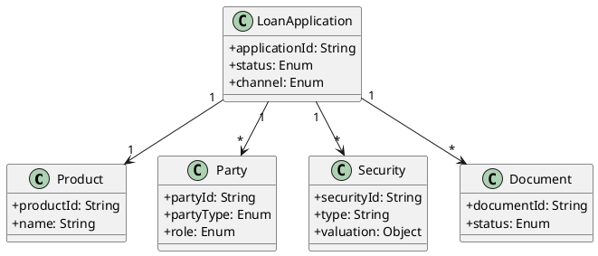
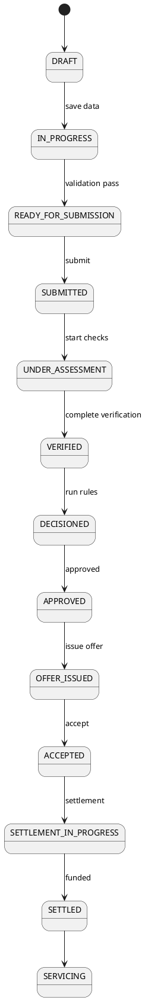
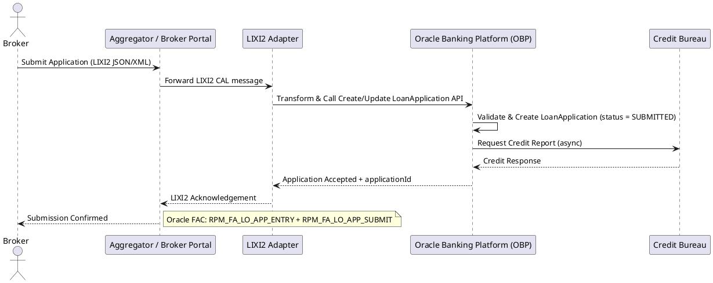
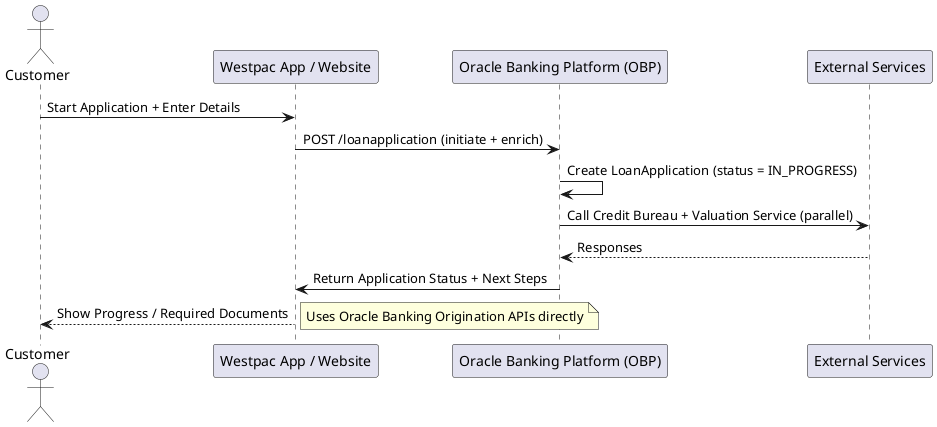
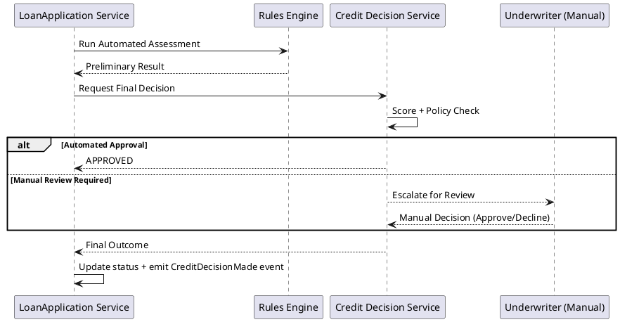

```markdown
# Mortgage Origination System – Software Requirements Specification (SRS)

**Project**: Atheryon Mortgages  
**Repository**: https://github.com/atheryon-ai/atheryon-mortgages  
**Version**: 1.3 (with PlantUML Diagrams)  
**Date**: 13 April 2026  
**Status**: Ready for Technical Design  
**Audience**: Claude – for producing detailed HLD, ERD, Swagger/OpenAPI, DB schema, microservices, state machines, and LIXI2 adapters.

## 1. Introduction & Purpose
This SRS defines **ALL** required data objects, lifecycles, domain events, and business processes for a mortgage origination system modelled on **Westpac’s One Bank Platform (Oracle Banking Platform – Origination of Loans & Mortgages)**.

It integrates:
- Oracle Banking APIs + Functional Activity Codes (FACs)
- LIXI2 Credit Application Standard (CAL – JSON/XML)
- Australian CDR Open Banking Product API

## 2. Scope
**In Scope**: Full residential mortgage origination (purchase, refinance, construction, equity release) for broker + direct channels, from pre-approval to settlement hand-off.  
**Out of Scope**: Post-settlement servicing, commercial lending.

## 3. Business Processes
1. Product Enquiry / Pre-Application  
2. Application Initiation / Capture  
3. Application Submission  
4. Assessment & Verification  
5. Decisioning & Approval  
6. Offer & Acceptance  
7. Settlement & Funding  
8. Hand-Off to Servicing

## 4. Detailed Data Model

### 4.1 Product (CDR + Oracle Business Product)
```json
{
  "productId": "string",
  "productType": "MORTGAGE",
  "name": "string",
  "lendingRates": [{ "rateType": "VARIABLE|FIXED", "rate": "decimal", "comparisonRate": "decimal" }],
  "features": ["OFFSET_ACCOUNT", "REDRAW", "PORTABLE", "CASHBACK", "MULTI_OFFSET"],
  "eligibility": { "minimumAge": "int", "maximumLTV": "decimal", "minimumLoanAmount": "decimal" },
  "fees": [{ "feeType": "string", "amount": "decimal" }]
}
```

### 4.2 Party (Oracle Party + LIXI2)
```json
{
  "partyId": "string",
  "partyType": "INDIVIDUAL|COMPANY|TRUST|SMSF",
  "role": "BORROWER|CO_BORROWER|GUARANTOR",
  "personalDetails": { "fullName": "string", "dateOfBirth": "date", "taxFileNumber": "string" },
  "contact": { "email": "string", "mobile": "string" },
  "kycStatus": { "status": "VERIFIED|PENDING", "amlChecked": true },
  "employment": { "employerName": "string", "annualIncome": "decimal", "verified": true },
  "financials": "FinancialSnapshot reference"
}
```

### 4.3 LoanApplication (Root – Oracle + LIXI2 CAL)
```json
{
  "applicationId": "string",
  "status": "DRAFT|IN_PROGRESS|SUBMITTED|UNDER_ASSESSMENT|VERIFIED|DECISIONED|OFFER_ISSUED|ACCEPTED|SETTLEMENT_IN_PROGRESS|SETTLED|SERVICING",
  "productId": "string",
  "parties": [{ "partyId": "string", "role": "string" }],
  "loanDetails": {
    "purpose": "PURCHASE|REFINANCE|CONSTRUCTION",
    "requestedAmount": "decimal",
    "termMonths": "int",
    "interestType": "VARIABLE|FIXED",
    "repaymentFrequency": "MONTHLY|FORTNIGHTLY"
  },
  "securities": [{ "securityId": "string" }],
  "documents": [{ "documentId": "string" }],
  "decisionRecord": {},
  "offerDetails": {},
  "channel": "BROKER|DIRECT",
  "timestamps": { "createdAt": "datetime", "submittedAt": "datetime" }
}
```

### 4.4 Security / Collateral
```json
{
  "securityId": "string",
  "type": "RESIDENTIAL_PROPERTY",
  "address": { "fullAddress": "string", "postcode": "string" },
  "ownership": [{ "partyId": "string", "percentage": "decimal" }],
  "valuation": { "estimatedValue": "decimal", "ltv": "decimal", "valuationDate": "date" }
}
```

Supporting entities: FinancialSnapshot, Document, DecisionRecord, Offer, Valuation, LMIQuote, ConsentRecord, WorkflowEvent.

**Core Relationships**:
- LoanApplication 1→N Party (via roles)
- LoanApplication 1→N Security
- LoanApplication 1→1 Product

## 5. PlantUML Diagrams

### 5.1 Domain Class Diagram


### 5.2 LoanApplication State Machine


### 5.3 Sequence Diagram: Broker Application Submission (LIXI2 Flow)


### 5.4 Sequence Diagram: Digital Direct Application Flow


### 5.5 Sequence Diagram: Assessment & Decisioning


## 6. Domain Events
- LoanApplicationCreated
- LoanApplicationSubmitted
- ApplicationAssessed
- ValuationReceived
- CreditDecisionMade
- OfferIssued
- OfferAccepted
- SettlementCompleted
- LIXI2MessageReceived / Sent

## 7. Integration & Non-Functional Requirements
- Inbound LIXI2 transformation layer
- Real-time CDR Product consumption
- Full audit trail on every state change
- Straight-through processing target: <30s for simple cases
- Oracle-style extensibility points

## 8. Next Steps for Claude
Use the diagrams + data models to generate:
- Detailed ERD / PostgreSQL schema
- Full Swagger/OpenAPI contracts mirroring Oracle Banking APIs
- Executable state machine code
- Microservices architecture with LIXI2 adapter
- Event-driven backbone

**End of Document – Version 1.3**
```
